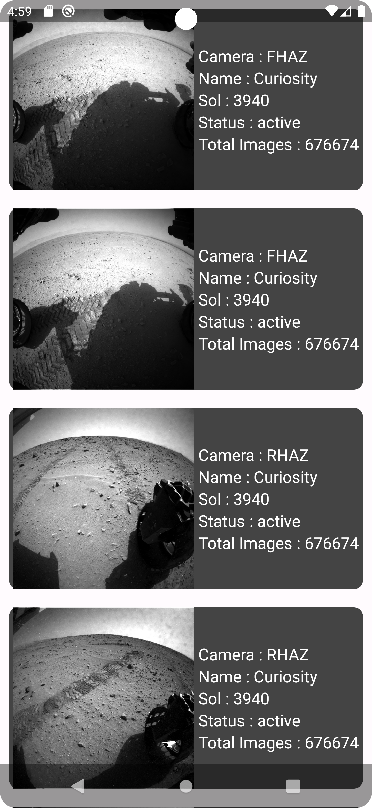
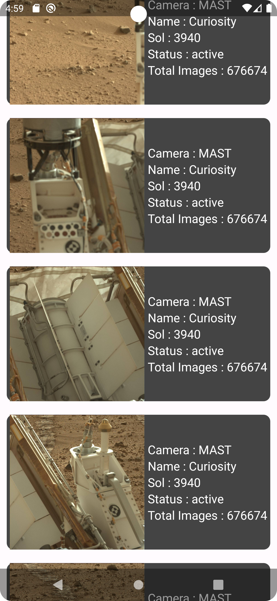

# [COSMOS] Space science app Built using [Kotlin Multiplatform]

> **Note**
> Compose Multiplatform for iOS is in Alpha. It may change incompatibly and require manual migration in the future.
> We would appreciate your feedback on it in the public Slack channel [#compose-ios](https://kotlinlang.slack.com/archives/C0346LWVBJ4/p1678888063176359).
> If you have any issues, please report them on [GitHub](https://github.com/JetBrains/compose-multiplatform/issues).

You can use this template to start developing your own [Compose Multiplatform](https://github.com/JetBrains/compose-multiplatform#readme) mobile application targeting Android and iOS.
Follow our tutorial below to get your first Compose Multiplatform app up and running.
The result will be a [Kotlin Multiplatform](https://kotlinlang.org/docs/multiplatform.html) project that uses the Compose Multiplatform UI framework.

